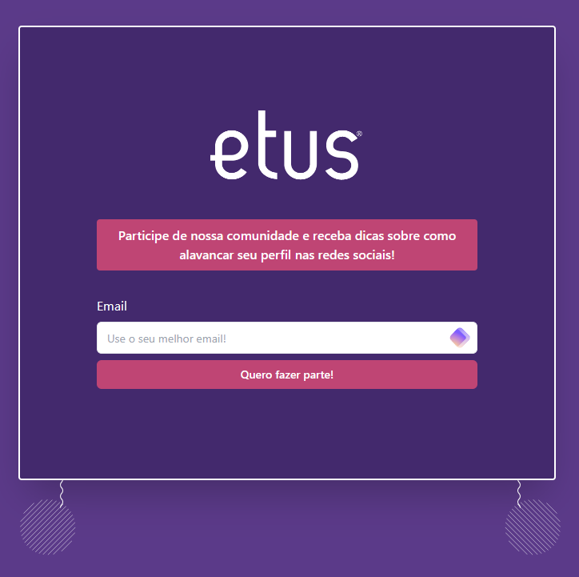

## PROJETO ETUS
Este é um pequeno projeto Fullstack para demonstrar algumas habilidades usando Laravel e Vue.js.



### Considerações
- O projeto está em um container Docker, siga as instruções abaixo para usar em sua máquina.
- Todo o passo a passo assume que você já tenha conhecimento prévio com Docker e Terminais.

### Configuração - Projeto
Clone o projeto em seu diretório local:
```bash
git clone https://github.com/doiska/projeto-etus.git
```

### Configurações iniciais
- O banco de dados já está configurado no arquivo default, mas você pode fazer alterações.

Abra seu [Docker](https://www.docker.com/products/docker-desktop/) e por fim, crie o projeto:
```bash
docker compose up
```

Você pode removê-lo mais tarde usando:
```bash
docker compose down
```


### Configuração - Laravel

Primeiro, acesse o serviço do php (onde o Laravel está armazenado).
```bash
docker exec -it etus_php bash
```

Instale todas as dependências do Laravel:
```bash
composer install
```

Copie `.env.default` para `.env` e configure as variáveis que desejar.
```bash
cp .env.default .env
```

Crie uma application key [(docs)](https://laravel.com/docs/11.x/encryption#configuration):
```bash
php artisan key:generate
```

Crie todas as tabelas do banco de dados usando migrations [(docs)](https://laravel.com/docs/11.x/migrations#main-content):
```bash
php artisan migrate
```

### Configuração - Vue.js (Opcional)
Você pode usar o Frontend como preferir, com ou sem o Docker.
Em meus testes, senti uma drástica melhora fora do Docker. 

**Existem consequências:**
- Você **deve** possuir a mesma versão do Node.js que está sendo utilizada. Para evitar incompatibilidades.
- Diferente de uma instalação com Docker, o Node.js será instalado em sua máquina, e não em um Container.

**Docker**:
- A versão com Docker do Vite já está configurada, basta ter iniciado com o ```docker compose up```.
- Caso a utilize para desenvolvimento, você precisará ter todos os pacotes instalados na raiz também, pois a pasta **node_modules** é efêmera e existe apenas dentro do Docker.
  - Para fazer isto, tenha Node.js instalado na versão correspondente e use ``npm install`` na raiz da pasta /web.
- Acesse `http://localhost` - Não é necessário informar uma porta, pois já está no nginx.

**Sem Docker**
- Entre no arquivo docker-compose.yml e adicione comentários nas linhas 32 a 45, isto desativará o serviço do frontend.
- Instale [Node.js (**LTS 20**)](https://nodejs.org/en/download).
- Dentro da pasta /web, execute o comando ``npm install``.
- Em seguida, inicie o servidor de desenvolvimento com ``npm run dev``.
- Acesse `http://localhost:5173`

## Testes

**ATENÇÃO: Para realizar testes, você deve ter um ambiente Laravel configurado!**

Caso tenha saído do bash de dentro do serviço, acesse-o novamente:
```bash
docker exec -it etus_php bash
```

Execute todos os testes usando PhpUnit
```bash
php artisan test
```
